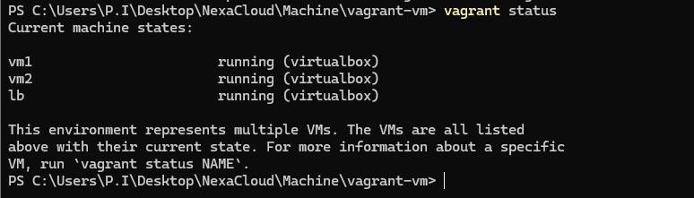

# Task: Load Balancer Implementation
**Objective:** Set up HAProxy as a load balancer for web servers

## **TASK1:**
1. Deploy two servers with **different** content
2. Install and configure HAProxy as load balancer on a different VM
*****

## 1. **Deploy two web servers with **different** content**
 
 ### STEP 1 : Create Virtual Machines

 * Create Vagrant File to Create Three Virtual Machines Specifiying :
    * Name
    * IP address
    * Memory
    * CPU allocation
    
    
        
            Vagrant.configure("2") do |config|
            #Define a common box for all VMs
            config.vm.box = "ubuntu/bionic64"

            #Defining Virtual Machine 1
            config.vm.define "vm1" do |vm1|
                vm1.vm.hostname = "vm1"
                vm1.vm.network "private_network", ip: "192.168.56.10"
                vm1.vm.provider "virtualbox" do |vb|
                vb.memory = "1024"
                vb.cpus = "1"
                end
            end

            #Defining Virtual Machine 2
            config.vm.define "vm2" do |vm2|
                vm2.vm.hostname = "vm2"
                vm2.vm.network "private_network", ip: "192.168.56.12"
                vm2.vm.provider "virtualbox" do |vb|
                vb.memory = "1024"
                vb.cpus = "1"
                end
            end

            #Defining Load Balancer
            config.vm.define "lb" do |lb|
                lb.vm.hostname = "lb"
                lb.vm.network "private_network", ip: "192.168.56.14"
                lb.vm.provider "virtualbox" do |vb|
                vb.memory = "512"
                vb.cpus = "1"
                end
            end

            end

### STEP 2 : StartUp all Machine

* In Windows PowerShell, Change Directory To Vagrant Folder

       cd ./ C:\Users\P.I\Desktop\NexaCloud\Machine\vagrant-vm

* StartUp all Virtual Machine
    
        Vagrant up

* Check Machine Status

        vagrant status

* Load  Virtual Machine in another Power Shell Windows

        cd ./ C:\Users\P.I\Desktop\NexaCloud\Machine\vagrant-vm

        vagrant ssh vm1      #startup vm1

        vagrant ssh vm2      #startup vm2

* Evidence of Machines Running

### STEP 3 : Load Content into Machines

* Install Nginx on vm1 & vm2

        sudo apt update
        sudo apt install -y nginx

* Load Content into vm1 & vm2

        #Add content in /var/www/html/index.html
        
        sudo nano  /var/www/html/index.html 

            or
    
        echo "<h1>This is Machine 1</h1>" | sudo tee /var/www/html/index.html

        echo "<h1>This is Machine 2</h1>" | sudo tee /var/www/html/index.html

* Enable  & Restart Nginx 

        sudo systemctl enable nginx
        sudo systemctl start nginx

* Display Content of vm1 & vm2

        
        

## 2. Install and configure HAProxy as load balancer on a different VM

### STEP 1 : StartUp load Balancer Virtual Machine (lb)

* Load  Virtual Machine in another Power Shell Windows

        cd ./ C:\Users\P.I\Desktop\NexaCloud\Machine\vagrant-vm

        vagrant ssh lb      #startup lb

### STEP 2 : Install haproxy Load balancer in virtual Machine

        sudo apt update
        sudo apt install -y haproxy

### STEP 3 : Configure Haproxy as a Load balancer on lb

* Open /etc/haproxy/haproxy.cfg file

        sudo nano /etc/haproxy/haproxy.cfg

* Add the Frontend Configuration to the file

        frontend http_front
        bind *:80
        default_backend http_back

* Add the Backend Configuration File to the file along with vm1 & vm2 ip address

        backend http_back
        balance roundrobin
        server web1 192.168.56.10:80 check
        server web2 192.168.56.12:80 check

* Restart haproxy

        sudo systemctl restart haproxy

### STEP : Verify Load Balancer

* Using Load Balancer Ip address,in web browser

     http://192.168.56.14

  

* The ip address bounce between machine 1 & 2 at interval 

  

## **TASK3:**

3. Implement for :
    * Round-robin Algorithm
    * Least connections Algorithm
    * IP hash Algorithm

## Round-robin Algorithm

* Add the Algorithm to the Configuration File /etc/haproxy/haproxy.cf

        backend http_back
        balance roundrobin
        server web1 192.168.56.10:80 check
        server web2 192.168.56.12:80 check

* Restart haproxy

        sudo systemctl restart haproxy

Screenshot: 

   

## Least Connect Algorithm

* Add the Algorithm to the Configuration File /etc/haproxy/haproxy.cf

        backend http_back
        balance leastconn
        server web1 192.168.56.10:80 check
        server web2 192.168.56.12:80 check

* Restart haproxy

        sudo systemctl restart haproxy
* Screenshot: 

  

## IP Hash Algorithm

* Add the Algorithm to the Configuration File /etc/haproxy/haproxy.cf

        backend http_back
        balance source
        server web1 192.168.56.10:80 check
        server web2 192.168.56.12:80 check

* Restart haproxy

        sudo systemctl restart haproxy

  Screenshot: 

   
